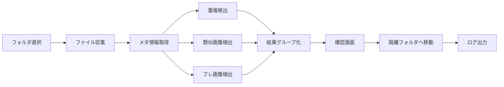

# 基本設計書

## 1. システム概要

MediaClinaerは、Windows上で動作するPython + PySide6製のデスクトップアプリケーションとして設計する。ローカルPC、外付けディスク、NAS共有フォルダ上の画像・映像ファイルをスキャンし、整理候補を検出してユーザーに提示する。

## 2. 基本構成



## 3. 主要画面

### 3.1 スキャン設定画面

- 対象フォルダを追加・削除できる
- ローカルフォルダ、ネットワークドライブ、UNCパスを指定できる
- 対象ファイル種別を選択できる
- 類似画像とブレ画像の検出を有効・無効にできる
- 隔離フォルダを指定できる

### 3.2 スキャン進捗画面

- 処理中のフォルダ
- 処理済みファイル数
- 検出された候補数
- 読み取り失敗件数
- 中断ボタン

### 3.3 検出結果画面

- 完全重複
- 類似画像
- ブレ画像
- 重複映像

各分類ごとに候補グループを表示する。類似動画検出は初期版では表示しない。

### 3.4 確認画面

- サムネイルまたは映像情報
- ファイル名
- パス
- サイズ
- 更新日時
- 選択チェック

### 3.5 実行結果画面

- 移動に成功した件数
- 失敗した件数
- ログの保存場所

## 4. データモデル

### MediaFile

| 項目 | 内容 |
| --- | --- |
| id | 内部ID |
| path | ファイルパス |
| storage_type | local, removable, network |
| media_type | image または video |
| extension | 拡張子 |
| size_bytes | ファイルサイズ |
| modified_at | 更新日時 |
| sha256 | ファイルハッシュ |
| perceptual_hash | 画像用の知覚ハッシュ |
| blur_score | 画像用の鮮明度スコア |
| scan_error | 読み取り失敗時のエラー内容 |
| cache_status | fresh, reused, stale |

### DetectionGroup

| 項目 | 内容 |
| --- | --- |
| id | 内部ID |
| group_type | duplicate_image, similar_image, blurry_image, duplicate_video |
| file_ids | 候補ファイルID一覧 |
| confidence | 判定信頼度 |
| reason | 判定理由 |

### ActionLog

| 項目 | 内容 |
| --- | --- |
| id | 内部ID |
| action_type | scan, move_to_quarantine |
| source_path | 元ファイルパス |
| destination_path | 移動先ファイルパス |
| status | success または failed |
| message | 補足情報 |
| created_at | 実行日時 |

### QuarantineRecord

| 項目 | 内容 |
| --- | --- |
| id | 内部ID |
| original_path | 元ファイルの完全パス |
| quarantined_path | 隔離先ファイルの完全パス |
| original_size_bytes | 元ファイルサイズ |
| original_modified_at | 元ファイル更新日時 |
| quarantined_at | 隔離日時 |
| source_storage_type | local, removable, network |

### ScanCache

| 項目 | 内容 |
| --- | --- |
| id | 内部ID |
| file_path | ファイルパス |
| size_bytes | ファイルサイズ |
| modified_at | 更新日時 |
| sha256 | ファイルハッシュ |
| perceptual_hash | 画像用の知覚ハッシュ |
| blur_score | 画像用の鮮明度スコア |
| last_scanned_at | 最終スキャン日時 |

### ScanSession

| 項目 | 内容 |
| --- | --- |
| id | 内部ID |
| started_at | スキャン開始日時 |
| finished_at | スキャン終了日時 |
| target_paths | 対象フォルダ一覧 |
| cache_used_count | キャッシュ利用件数 |
| error_count | エラー件数 |

## 5. 処理方式

### 5.1 ファイル収集

指定フォルダ配下を再帰的に走査し、対象拡張子のファイルだけを収集する。UNCパスやネットワークドライブも通常のパスとして扱う。

### 5.2 NASアクセス

NASの認証はWindows側で済んでいる前提とする。アプリ内でNASのユーザー名やパスワードは保存しない。ネットワーク切断、権限不足、ファイルロックなどのエラーは個別に記録し、可能な限り処理を続行する。

### 5.3 完全重複検出

ファイルサイズで一次分類し、サイズが一致するファイルだけハッシュ値を計算する。ハッシュ値が一致するファイルを同一グループにまとめる。

### 5.4 類似画像検出

画像を縮小・正規化して知覚ハッシュを作成する。ハッシュ間距離が設定値以下の画像を類似候補にする。

### 5.5 ブレ画像検出

グレースケール化した画像にラプラシアンを適用し、分散値から鮮明度スコアを計算する。

### 5.6 隔離処理

選択されたファイルをPCローカル上の1つの隔離フォルダへ移動する。初期隔離フォルダはアプリフォルダ配下に作成する。ファイル名が衝突する場合は連番またはハッシュを付与する。NASからローカル隔離フォルダへ移動する場合は、コピー完了後に元ファイルを削除する。コピーが失敗した場合は元ファイルを残す。

隔離後は、元ファイルの完全パスと隔離先の完全パスを `QuarantineRecord` として保存する。

### 5.7 キャッシュ処理

スキャン結果と解析済みファイル情報をアプリフォルダ配下のキャッシュフォルダに保存する。次回スキャン時は、ファイルパス、サイズ、更新日時が一致する場合にキャッシュを利用し、ハッシュ計算や画像解析を省略する。ファイルが変更されている場合は再解析する。

キャッシュの保持期間は無期限とし、自動削除は行わない。

### 5.8 長いパス処理

Windowsの長いパスはPythonの `pathlib` と標準ファイルAPIで可能な範囲まで扱う。処理できないパスに遭遇した場合は、そのファイルだけをエラーとして記録し、スキャン全体は継続する。

長いパスの扱いは詳細設計で以下を確認する。

- UNCパス
- ネットワークドライブ
- 隔離先パス生成時のファイル名衝突
- 隔離先がさらに長くなるケース

## 6. 技術選定

初期実装はPython + PySide6のWindowsデスクトップアプリとして作る。配布はPortable形式を前提とする。

画像処理の候補:

- Pillow
- imagehash
- OpenCV

配布方法:

- PyInstaller
- インストーラーなしのPortable配布

## 7. 起動時チェック

アプリ起動時に、アプリフォルダ配下へ `cache`、`logs`、`quarantine` を作成できるか確認する。作成または書き込みができない場合は、処理を開始せず、書き込み可能な場所へアプリフォルダを移動するよう表示する。

## 8. NAS対応時の注意点

- ローカルディスクより読み取りが遅い
- 接続が切れる可能性がある
- パスが長くなる可能性がある
- ファイル移動がコピーと削除に分かれる可能性がある
- 同じNAS上でも共有名が違うと別パスとして扱われる
- NASからPCローカルへ隔離する場合、コピー後削除の途中失敗に備える必要がある

## 9. キャッシュ方針

キャッシュは「前回結果を見るため」と「再スキャンを速くするため」の両方に使う。保存場所はアプリフォルダ配下を想定する。

初期候補:

- `<app_folder>\cache`
- `<app_folder>\logs`
- `<app_folder>\quarantine`

キャッシュは無期限に保持する。キャッシュ内には、元ファイルと隔離ファイルを完全パスで紐づける情報を保存する。

保存形式はSQLiteとする。設定値はJSONに保存し、人が読むログはテキストとして出力する。

想定ファイル:

- `<app_folder>\cache\media_clinaer.sqlite3`
- `<app_folder>\config.json`
- `<app_folder>\logs\app.log`

## 10. 保存形式方針

検出結果、解析キャッシュ、隔離履歴はSQLiteに保存する。設定ファイルはJSONに保存する。人が読むログは `logs` フォルダにテキストとして出力する。

SQLiteに保存する主な情報:

- スキャンセッション
- メディアファイル情報
- 検出グループ
- 解析キャッシュ
- 隔離履歴

JSONに保存する主な情報:

- 対象拡張子
- 類似画像判定のしきい値
- ブレ画像判定のしきい値
- 最後に使用したスキャン対象フォルダ

## 11. Portable配布方針

アプリ本体、キャッシュ、ログ、隔離ファイルを同じアプリフォルダ配下で管理する。ユーザーはフォルダごと移動またはバックアップできる。

想定構成:

```text
MediaClinaer/
  MediaClinaer.exe
  cache/
  logs/
  quarantine/
```
